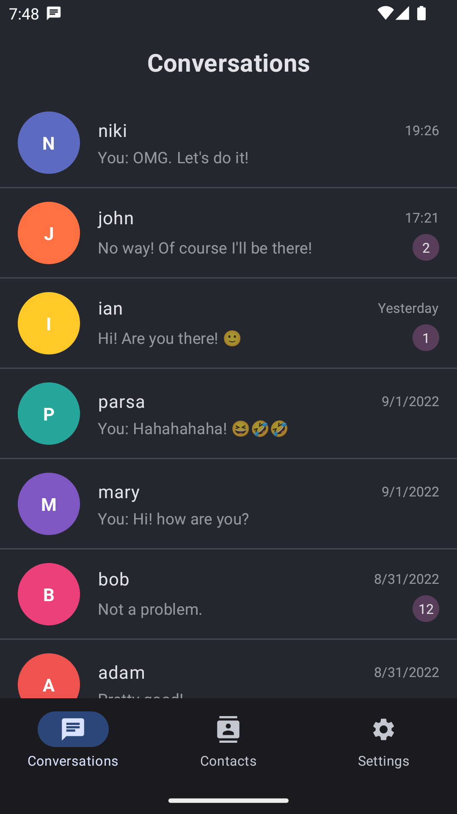
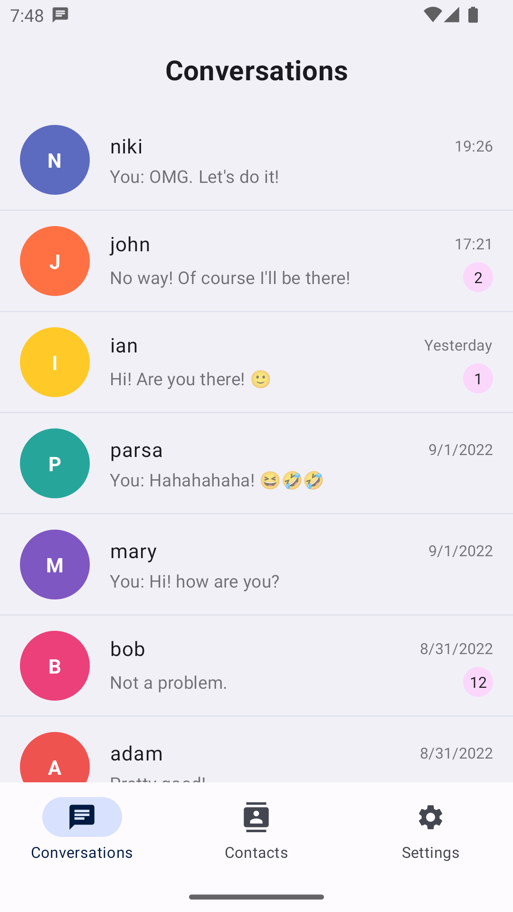
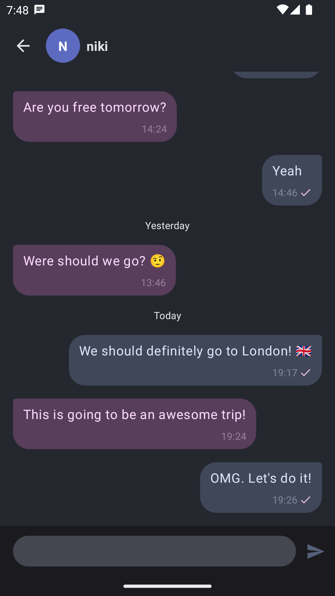

# Dialogue App

Dialogue is an Android XMPP/Jabber chat client using [Smack](https://github.com/igniterealtime/Smack) and built entirely with Kotlin and Jetpack Compose.

## 📷 Screenshots

<p align="center">





</p>

## FAQ

### How do I login to Dialogue?

You can login to Dialogue with your favorite standard XMPP server credentials. I personally use [jix.im](https://jix.im) to create free XMPP accounts.

# License
```xml
Copyright 2022 The Dialogue App

Licensed under the Apache License, Version 2.0 (the "License");
you may not use this file except in compliance with the License.
You may obtain a copy of the License at

   http://www.apache.org/licenses/LICENSE-2.0

Unless required by applicable law or agreed to in writing, software
distributed under the License is distributed on an "AS IS" BASIS,
WITHOUT WARRANTIES OR CONDITIONS OF ANY KIND, either express or implied.
See the License for the specific language governing permissions and
limitations under the License.
```
